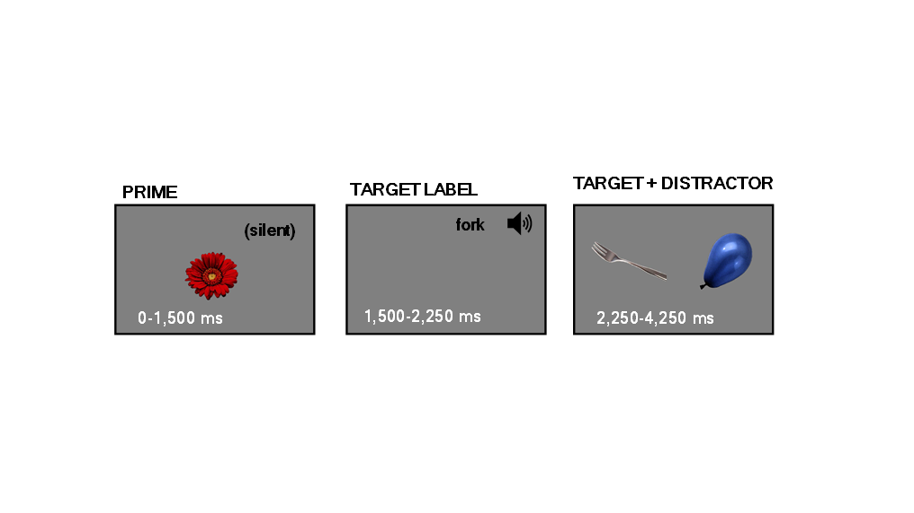
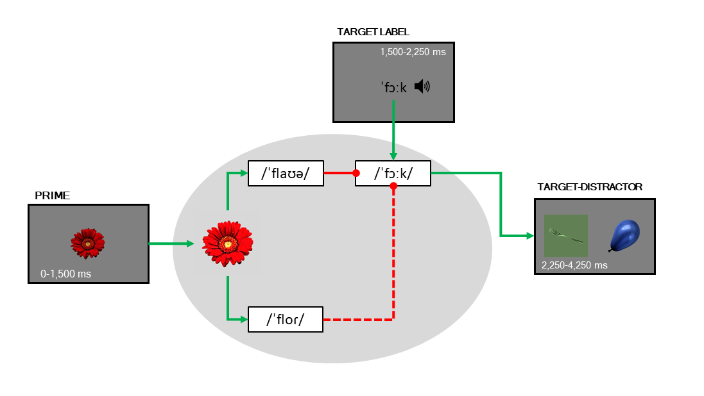

```{r setup, include=FALSE}
knitr::opts_chunk$set(echo = TRUE)
```

```{r prepare, message=FALSE, warning=FALSE, include=FALSE, paged.print=FALSE}
library(gt)
library(tibble)
library(ggplot2)
library(tidyr)
library(dplyr)
library(tidybayes)
library(stringr)
library(forcats)
library(targets)
library(scales)
library(here)

source(here::here("R", "utils.R"))

tar_load(participants)
tar_load(attrition)
tar_load(gaze)
tar_load(model_fits)

# withr::with_dir("../..", tar_load(participants))
# withr::with_dir("../..", tar_load(attrition))
# withr::with_dir("../..", tar_load(gaze))
# withr::with_dir("../..", tar_load(model_fits))

fit <- model_fits$fit

```

## Background

Infants learning two languages face the challenge of having to learn two distinct sets of words. Some of the words across both languages refer to similar concepts: for instance, *chair* and *silla* (in Spanish). These pairs of words are called *translation equivalents*. Sometimes, translation equivalents also overlap in form, frequently due to their shared etymological origin. These form-similar translation equivalents, such as *boot* and *bota* (in Spanish), are referred to as *cognates*.

There is extensive literature on how cognateness impacts the dynamics of lexical access during words comprehension and production. One of its main findings is that bilinguals process cognates (such as *boot* and *bota*) more differently than non-cognates (such as *chair* and *silla*). For instance, @costa2000cognate asked Spanish-Catalan bilinguals to name a series of familiar pictures in Spanish. Part of the pictures referred to objects whose labels in Spanish and Catalan were cognates, whereas the other pictures referred to non-cognates. On average, participants named cognate pictures faster than non-cognate pictures. This effect was independent of lexical frequency and, critically, was not observed when Spanish monolinguals performed the same task. This suggests that bilinguals activated labels in both languages, and that their phonology interacted to facilitate naming.

Later studies provided evidence that the locus of this facilitation effect was at the lexical level, and not just at the articulatory level [reference needed here]: this effect has also been reported during comprehension, at both the visual-orthographic and the auditory-phonology modalities) [e.g., @thierry2007brain]. Overall, these findings have led researchers to hypothesise that lexical access is language-non selective, that is, bilinguals activate lexical representations in both languages in parallel during comprehension and production, based on their semantic and phonological overlap.

This cross-talk between languages has also been suggested to be present in children's and toddlers' lexicon [@von2012language; @bosma2020cognate], but it is still unclear how it impacts the trajectories of language acquisition at these early ages. In this study we sought to investigate the developmental trajectories of lexical access in a cohort of Catalan-Spanish and English-Spanish bilinguals.

To do this, we used an adaptation of @mani2010infant's priming paradigm. This paradigm consists of a spoken word recognition task in which participants are first presented with a picture in silence in the centre of the screen for 1.5 seconds. Then, two other pictures are presented side-by-side during 2 seconds, and one of them is named. The other is not. Looking times to the target picture are recorded from name onset. From now on, I will refer to the silent picture presented first as the *prime*, to the named picture as the *target*, and to the non-named picture presented next to the target as *distractor*. 

In their experiment, Mani and Plunkett manipulated the phonological overlap between the prime label and the target label: in some trials, both labels shared phonological onset (*bee*-*ball*), whereas in other trials they did not share phonological onset (*cow*-*book*). In all trials, the distractor label did not share onset with either of the prime or target labels (e.g., *teeth*). The authors registered 18 month-old participants' looking preference for the target object after name onset, as a proxy of word recognition, and found that target preference was stronger after a phonologically related prime than after a phonologically unrelated prime. There results have three main implications:

1) Phonologically related prime pictures facilitated target recognition
2) This is only possible if participants lexicalised the prime pictures, even though this picture was presented in silence
3) The label participants generated upon prime picture presentation was phonologically detailed, and this phonological form interacted with the auditory recognition of a subsequently presented word

In a subsequent study, the authors found the inverse effect in 24 month-old toddlers: target looking preference was weaker after a phonologically related prime picture compared to after an unrelated one [@mani2011phonological]. The authors suggested that the change in the direction of the effect observed between 18 and 24 month-old participants was due to the increment in vocabulary size and the establishment of (inhibitory) links between phonologically related lexical entries that might have occurred between both ages. Supporting this account, the inhibition effect they reported was stronger as the number of phonological neighbours of the target increased: the recognition of words surrounded by more phonologically related neighbours suffered the most from the priming effect.

We adapted this paradigm to test the language-non selectivity account in bilingual toddlers. Following Mani & Plunkett's original implementation, In our task half of the prime-target pairs in the trial lists shared phonological onset, and the other half did not share phonological onset. We added a novel manipulation: half of the primes in the phonologically related condition were cognates and the other half were non-cognates. We classified two translation equivalents as cognates if they shared phonological onset. Here is an illustration of each trial type:

```{r trials, echo=FALSE, message=FALSE, warning=FALSE, paged.print=FALSE}

tribble(
	~trial_type, ~prime, ~target, ~distractor,
	"Cognate (N = 8)", "flower (flor)", "fork", "balloon",
	"Non-cognate (N = 8)", "tree (árbol)", "truck", "phone",
	"Unrelated (N = 16)", "penguin (pingüino)", "table", "shoe"
) %>% 
	gt() %>% 
	cols_label(
		trial_type = "Prime type",
		prime = "Prime",
		target = "Target",
		distractor = "Distractor"
		
	)
```


This is what a trial looks like [see figure below]:



## Hypotheses

If participants lexicalise the prime pictures in a language-non selective way, they should generate two labels upon prime picture presentation: one in each language. Therefore, if lexical access is language non-selective, in cognate trials two prime labels should interfere with target recognition (since both prime labels share onset with the target). In non-cognate trials, only one prime label should interfere with the target. Finally, in unrelated trials no prime labels should interfere with the target. As a result, we expect bilingual participants' target looking preference to be weaker in cognate trials than in non-cognate trials, and in cognate and non-cognate trials than in unrelated trials.



We also collected data from same-aged monolingual participants as a control group: in this group we also expect to find weaker target looking in cognate and non-cognate trials, compared to unrelated trials, but no differences between cognate and non-cognate trials (these participants should be insensitive to the cognate status of the primes).


## Participants

We planned to collect data from participants learning English and/or Spanish in Oxford, and from participants learning Catalan and/or Spanish in Barcelona. Due to limitations imposed by the pandemic and lockdown, data collection in Oxford was severely interrupted, so I will present preliminary data from participants tested in Barcelona exclusively. 

We tested participants at three age points: 21, 25, and 30 months, to explore their trajectories of lexical access through these sensitive ages in which participants' vocabulary size is growing a full speed [Reference here.]

We classified participants as monolinguals or bilinguals by estimating their overall exposure to each of their languages using @bosch2001evidence. Following the consensus reached by the ManyBabies consortium [@byers2021multilab], participants exposed to any languages more than 80% of the time were classified as monolinguals. Otherwise, participants were classified as bilinguals. Participants exposed more than 10% to a third language or a language other than Catalan and Spanish (in Barcelona) or English and Spanish (in Oxford) were excluded from data analysis.

This is how testing sessions are distributed across ages and language profiles:


```{r participants, echo=FALSE, message=FALSE, warning=FALSE, paged.print=FALSE}
participants %>% 
	left_join(distinct(attrition, participant, age_group, valid_participant)) %>% 
	filter(location=="Barcelona", valid_participant) %>% 
	count(test_language, age_group, lp) %>% 
	drop_na() %>% 
	pivot_wider(names_from = age_group, values_from = n) %>% 
	rowwise() %>% 
	mutate(N = sum(`21 months`, `25 months`, `30 months`)) %>% 
	ungroup() %>% 
	relocate(lp) %>% 
	gt(groupname_col = "lp") %>% 
	cols_label(test_language = "Testing language", lp = "Group") %>% 
	summary_rows(columns = 3:6, fns = list(N = "sum"), decimals = 0)

n_total <- participants %>% 
	left_join(distinct(attrition, participant, age_group, valid_participant)) %>% 
	filter(location=="Barcelona", valid_participant) %>% 
	distinct(participant) %>% 
	count()

n_total_cohort <- participants %>% 
	left_join(distinct(attrition, participant, age_group, valid_participant)) %>% 
	filter(location=="Barcelona", valid_participant) %>% 
	distinct(participant, age_group) %>%
	count(participant) %>% 
	count(n, name = "n_cohort") %>% 
	group_split(n)

```

These 156 testing sessions correspond to `r n_total$n` distinct participants. Of these participants, `r n_total_cohort[[1]]` only participated once (I will refer top these participants as cross-sectional participants), `r n_total_cohort[[2]]` participated twice, and `r n_total_cohort[[3]]` participated three times.

## Data analysis

```{r echo=FALSE, message=FALSE, warning=FALSE, paged.print=FALSE}
n_obs <- nrow(fit$data)

n_trials_total <- distinct(fit$data, participant, target, trial_type) %>% 
	count() %>% 
	pull(n)

n_trials <- distinct(gaze, participant, trial, trial_type) %>% 
	count(trial_type) %>% 
	pull(n, name = trial_type)
```

In each testing session, participants were presented with 32 trials (8 cognate, 8 non-cognate and 16 unrelated). In each trial, we used an eye-tracker to register participants' looking time to the target picture. We delimited a time window of interest between 250 ms after the target onset and 150 ms before the target offset. This resulted in a 1,500 ms long time window. We divided this time window into 15 time bins of 100 ms each, and calculated the adjusted logit of the samples in which participants' gaze was located in the target coordinates, out of the total of valid samples in that time bin. This resulted in 15 observations per participant, per age group, and per trial. Our final dataset comprised `r n_obs` data points from `r n_trials_total` distinct trials: `r n_trials["Cognate"]`, cognate trials, `r n_trials["Non-cognate"]` trials, and `r n_trials["Unrelated"]` trials.

To model these data we used Growth Curve Analysis [@mirman2017growth]. First, we included `time_bin` as a fixed effect in our model to account for the correlation between the data points collected within each trial. We included this variable as a third degree polynomial, in order to account for the possibly non-linearity of the target fixations across the same trial (target fixations might increase rapidly at the beginning of the trial and decrease at the end of it. We then included our predictors of interest: age group (`age_group`), language profile (`lp`), trial type (`trial_type`), and the two-way interaction between language profile and trial type. Finally, we added random intercepts and slopes by participant and by target picture, to account for the possible correlation between time series from the same participant or trial (more details of the model at the end).

We estimated our model using the Bayesian framework, under which we estimate the probability of each value of the sampling space of each parameter, given the data we have observed. to do this, we used the brms R package [@burkner2017brms].


## Results

```{r echo=FALSE, message=FALSE, warning=FALSE, paged.print=FALSE}
draws <- gather_draws(fit, `b_.*`, `sigma`, regex = TRUE)

draws %>% 
	filter(!str_detect(.variable, "time_bin|sigma")) %>% 
	mutate(.value = ifelse(.variable=="b_Intercept", inv_logit(.value), .value/4)) %>% 
	ggplot(aes(.value, .variable, fill = stat(cut_cdf_qi(cdf, labels = percent, .width = c(0.50, 0.80, 0.95))))) +
	geom_vline(xintercept = 0, colour = "grey", size = 1) +
	stat_halfeye(point_color = "black", interval_color = "black") +
	labs(x = "Value", y = "Variable", fill = "CrI") +
	theme_ggdist() +
	scale_fill_brewer(direction = -1, na.translate = FALSE) +
	theme(
		panel.grid.major.y = element_line(colour = "grey"),
		axis.title.y = element_blank(),
		axis.title.x = element_blank(),
		legend.position = "top"
	)


```


```{r gaze_time, echo=FALSE, message=FALSE, warning=FALSE, paged.print=FALSE}
sample_size <- participants %>% 
	left_join(distinct(attrition, participant, age_group, valid_participant)) %>% 
	filter(valid_participant) %>% 
	count(lp)

n <- expand_grid(
	lp = c("Monolingual", "Bilingual"),
	age_group = c("25 months"),
	trial_type = unique(gaze$trial_type),
	time_bin_center = seq(min(gaze$time_bin_center), max(gaze$time_bin_center), 0.5)
)

m <- epred_draws(object = fit, newdata = n, ndraws = 20, re_formula = NA) %>% 
	mutate(.value = logit_to_prob(.epred))

ggplot(m, aes(time_bin_center, .value)) +
	facet_wrap(~fct_rev(lp)) +
	geom_line(aes(group = interaction(age_group, trial_type, lp, .draw),
				  colour = trial_type),
			  alpha = 0.15, size = 0.65) +
	stat_summary(aes(group = trial_type, colour = trial_type),
				 fun = mean, geom = "line", size = 1.25) +
	stat_summary(data = gaze, aes(y = logit_to_prob(logit_adjusted), group = trial_type,
								  colour = trial_type),
				 fun.data = mean_se, geom = "errorbar", size = 0.5, na.rm = TRUE,
				 position = position_dodge(width = 0.3)) +
	geom_text(data = sample_size, aes(x = min(gaze$time_bin_center), y = 0.95, label = paste0("N = ", n)),
			  colour = "white", hjust = 0, size = 5) +
	labs(x = "Time bin (100 ms)", y = "Expected posterior mean PTLT", colour = "Trial type",
		 fill = "Trial type", shape = "Trial type", linetype = "Trial type") +
	scale_color_brewer(palette = "Set1") +
	scale_x_continuous(breaks = min(gaze$time_bin_center):max(gaze$time_bin_center), labels = unique(gaze$time_bin)) +
	scale_y_continuous(limits = c(0, 1), labels = percent) + 
	theme_ggdist() +
	theme(
		legend.position = "top",
		legend.title = element_blank(),
		panel.grid.major.y = element_line(colour = "grey", size = 0.5, linetype = "dotted"),
		axis.text.x = element_text(size = 9),
		panel.grid.major.x = element_blank(),
		panel.grid.minor.x = element_blank()
	)
```


## References

