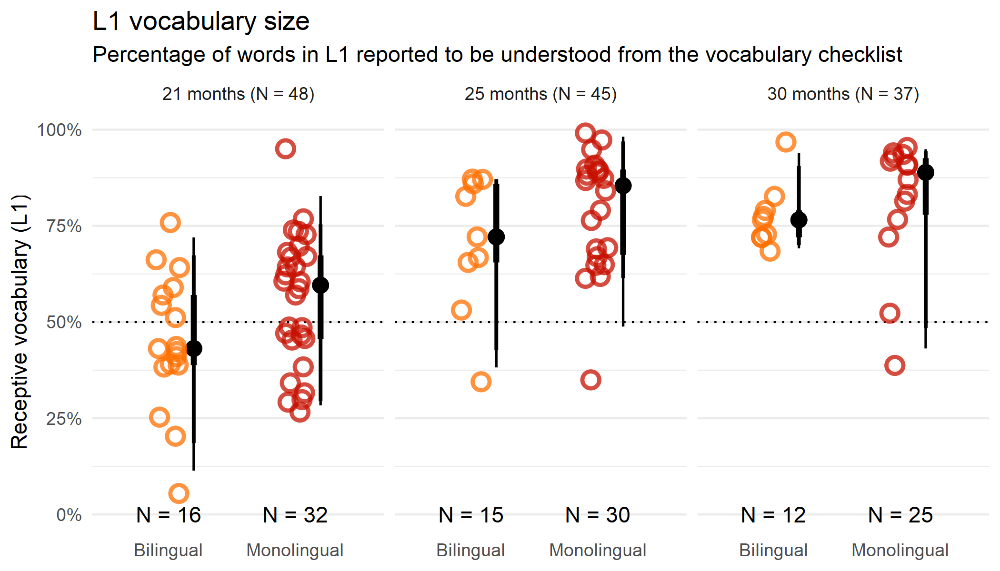
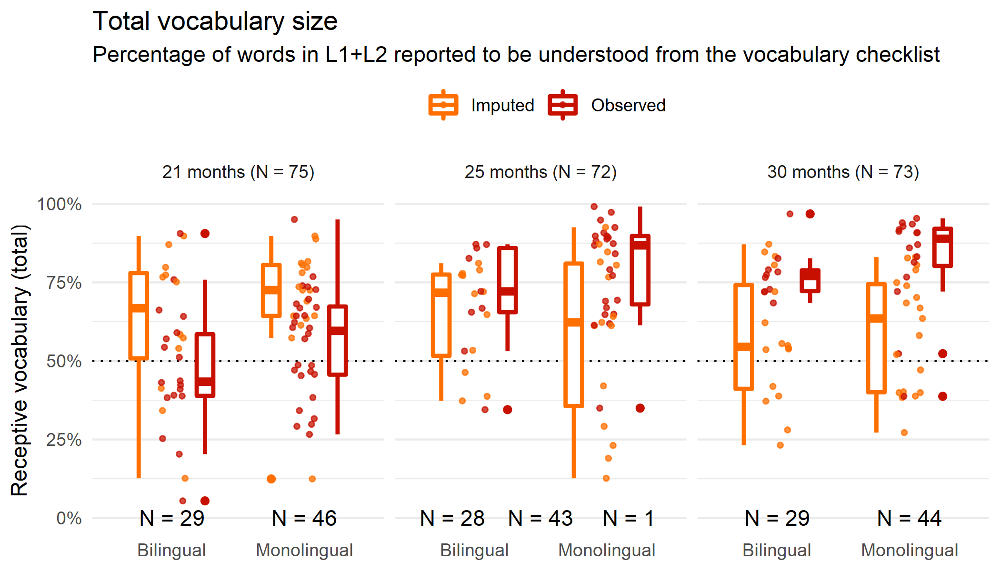
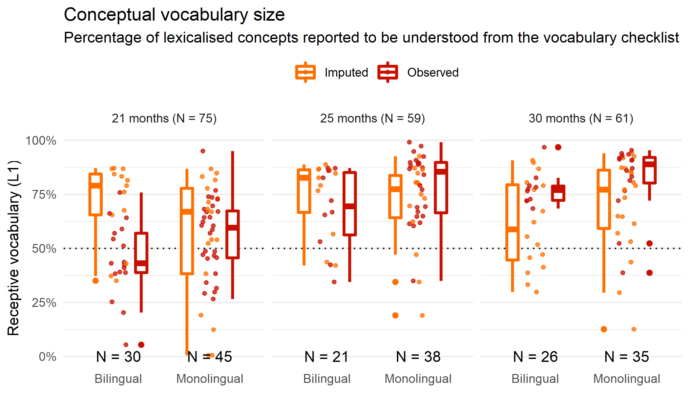

Vocabulary
================
Updated: 03/01/2022

We collected vocabulary data from participants. In Oxford, participants
were sent the online version of the Oxford Communicative Development
Inventory \[OCDI; @hamilton2000\] two weeks before each appointment. In
Barcelona, participants were sent the online vocabulary inventory
[MultiLex](https://github.com/gongcastro/multilex) immediately after the
appointment, and were given two weeks to fill it. In Oxford, families
filled the vocabulary checklist in the testing language, and when the
participant was monolingual, also in the second language. In Barcelona,
all participants filled the Catalan and the Spanish versions of the
vocabulary checklists. All checklists included the words involved in the
trial lists. When filling the vocabulary checklist, families checked
each word as being *understood*, *understood and produced* or *none*.
Each response to either checklist was aggregated to produce several
vocabulary measures:

-   **Total vocabulary**: total number of words the child knows, summing
    up both languages. For instance, a child who knows 210 words in
    Catalan and 100 words in Spanish would have a total vocabulary size
    of 210 words.
-   **L1 vocabulary**: number of words the child knows in the languages
    of higher exposure (i.e., testing language). For instance, for a
    child exposed to 75% Catalan who knows 210 words in Catalan and 100
    words in Spanish, their L1 vocabulary size would be 210 words.
-   **Conceptual vocabulary**: number of lexicalised concepts, that is,
    the number of concepts for which the child knows a word in at least
    one of the languages. For example, a Catalan-Spanish bilingual that
    knows *taula* and *mesa* – Catalan and Spanish translations of
    *table*– would have a conceptual vocabulary size of 1.

Vocabulary sizes of participants whose families failed to complete the
vocabulary checklists were imputed, by assigning them the most likely
vocabulary size from a distribution of vocabulary sizes of children of
similar age (± 1 month) and language profile (similar exposure to a
second language, ± 10%) that completed the same vocabulary checklist
previously.

# L1 vocabulary

This figure represents the vocabulary size in the dominant language of
participants in the Y-axis and their linguistic profile in the X-axis.
Results are presented separately for each age group. The shape of the
violins, represents the distribution of the vocabulary sizes. The
box-plot inside each violin represents the median, 25th and 75th
percentiles, and the vertical lines represent the minimum and maximum
values. vocabulary sizes in the dominant language were calculated as the
proportion of items each participant was reported to *understand* or
*understand and say* in the language of most exposure. for example, for
a participant exposed mostly to Catalan, their vocabulary size in the
dominant language was calculated as the proportion of words they were
reported to understand and/or say in Catalan, from a total of \~200
words.

# Total vocabulary

# Conceptual vocabulary

