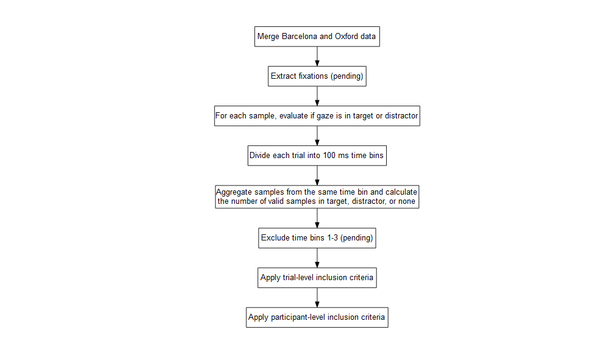

Analysis
================
Updated: 28/01/2022

# Gaze data

Each trial was divided into 100 ms time bins. for each time bin, the
proportion of target fixations were calculated, from the total of
fixations to the target, distractor and the rest of the screen for that
same time bin. Proportions were then aggregated across trials for each
time bin and participants, so that each participant contributed with 20
data points (one for each time bin) for each trial type (cognate,
non-cognate, and unrelated).

## Workflow

## Inclusion criteria

### Trial-level inclusion criteria

-   ≥ 50% or more valid samples during prime phase (1,500 ms)
-   ≥ 50% or more valid samples during target-distractor phase (2,000
    ms)
-   At least one sample in target and one sample in distractor
-   Participant understands prime word in both languages
-   Participant knows the target word in the test language
-   Participant knows the distractor word in the test language

### Participant-level inclusion criteria

-   ≥ 4 trials in *Cognate* condition (50%, from a total of 8)
-   ≥ 4 trials in *Non-cognate* condition (50%, from a total of 8)
-   ≥ 8 trials in *Unrelated* condition (50%, from a total of 16)
-   ≥ 36 gestational weeks
-   ≥ 2,800g birth weight
-   No diagnosed developmental, hearing, or visual disorders
-   Not exposed to more than 10% to a 3rd language

### Input variables

-   Linear (`ot1`), quadratic (`ot2`), and cubic (`ot3`) orthogonal
    polynomials of the time domain \[@mirman2014growth\].
-   Language profile (`lp`). Categorical predictor with two levels:
    *Monolingual* and *Bilingual*. Sum coded as *Monolingual* = -0.5,
    *Bilingual* = +0.5.
-   Trial type (`trial_type1` and `trial_type2`). Categorical predictor
    with three levels: *Cognate*, *Non-cognate*, and *Unrelated*. We
    coded two contrasts: `trial_type1`, comparing related trials
    vs. unrelated trials (*Cognate* + *Non-cognate* vs. *Unrelated*),
    and `trial_type2`, comparing *Cognate* vs. *Non-cognate* trials.
    These contrasts were sum-coded (see next table for a summary of the
    contrast coding) \[@schad2018capitalize\].

<table style="font-family: -apple-system, BlinkMacSystemFont, 'Segoe UI', Roboto, Oxygen, Ubuntu, Cantarell, 'Helvetica Neue', 'Fira Sans', 'Droid Sans', Arial, sans-serif; display: table; border-collapse: collapse; margin-left: auto; margin-right: auto; color: #333333; font-size: 16px; font-weight: normal; font-style: normal; background-color: #FFFFFF; width: auto; border-top-style: solid; border-top-width: 2px; border-top-color: #A8A8A8; border-right-style: none; border-right-width: 2px; border-right-color: #D3D3D3; border-bottom-style: solid; border-bottom-width: 2px; border-bottom-color: #A8A8A8; border-left-style: none; border-left-width: 2px; border-left-color: #D3D3D3;">
  
  <thead style="border-top-style: solid; border-top-width: 2px; border-top-color: #D3D3D3; border-bottom-style: solid; border-bottom-width: 2px; border-bottom-color: #D3D3D3; border-left-style: none; border-left-width: 1px; border-left-color: #D3D3D3; border-right-style: none; border-right-width: 1px; border-right-color: #D3D3D3;">
    <tr>
      <th style="color: #333333; background-color: #FFFFFF; font-size: 100%; font-weight: normal; text-transform: inherit; border-left-style: none; border-left-width: 1px; border-left-color: #D3D3D3; border-right-style: none; border-right-width: 1px; border-right-color: #D3D3D3; vertical-align: bottom; padding-top: 5px; padding-bottom: 6px; padding-left: 5px; padding-right: 5px; overflow-x: hidden; text-align: left;" rowspan="1" colspan="1"></th>
      <th style="color: #333333; background-color: #FFFFFF; font-size: 100%; font-weight: normal; text-transform: inherit; border-left-style: none; border-left-width: 1px; border-left-color: #D3D3D3; border-right-style: none; border-right-width: 1px; border-right-color: #D3D3D3; vertical-align: bottom; padding-top: 5px; padding-bottom: 6px; padding-left: 5px; padding-right: 5px; overflow-x: hidden; text-align: right; font-variant-numeric: tabular-nums;" rowspan="1" colspan="1">trial_type1</th>
      <th style="color: #333333; background-color: #FFFFFF; font-size: 100%; font-weight: normal; text-transform: inherit; border-left-style: none; border-left-width: 1px; border-left-color: #D3D3D3; border-right-style: none; border-right-width: 1px; border-right-color: #D3D3D3; vertical-align: bottom; padding-top: 5px; padding-bottom: 6px; padding-left: 5px; padding-right: 5px; overflow-x: hidden; text-align: right; font-variant-numeric: tabular-nums;" rowspan="1" colspan="1">trial_type2</th>
    </tr>
  </thead>
  <tbody style="border-top-style: solid; border-top-width: 2px; border-top-color: #D3D3D3; border-bottom-style: solid; border-bottom-width: 2px; border-bottom-color: #D3D3D3;">
    <tr><td style="padding-top: 8px; padding-bottom: 8px; padding-left: 5px; padding-right: 5px; margin: 10px; border-top-style: solid; border-top-width: 1px; border-top-color: #D3D3D3; border-left-style: none; border-left-width: 1px; border-left-color: #D3D3D3; border-right-style: none; border-right-width: 1px; border-right-color: #D3D3D3; vertical-align: middle; overflow-x: hidden; color: #333333; background-color: #FFFFFF; font-size: 100%; font-weight: initial; text-transform: inherit; border-right-style: solid; border-right-width: 2px; padding-left: 12px; text-align: left;">Cognate</td>
<td style="padding-top: 8px; padding-bottom: 8px; padding-left: 5px; padding-right: 5px; margin: 10px; border-top-style: solid; border-top-width: 1px; border-top-color: #D3D3D3; border-left-style: none; border-left-width: 1px; border-left-color: #D3D3D3; border-right-style: none; border-right-width: 1px; border-right-color: #D3D3D3; vertical-align: middle; overflow-x: hidden; text-align: right; font-variant-numeric: tabular-nums;">0.25</td>
<td style="padding-top: 8px; padding-bottom: 8px; padding-left: 5px; padding-right: 5px; margin: 10px; border-top-style: solid; border-top-width: 1px; border-top-color: #D3D3D3; border-left-style: none; border-left-width: 1px; border-left-color: #D3D3D3; border-right-style: none; border-right-width: 1px; border-right-color: #D3D3D3; vertical-align: middle; overflow-x: hidden; text-align: right; font-variant-numeric: tabular-nums;">0.5</td></tr>
    <tr><td style="padding-top: 8px; padding-bottom: 8px; padding-left: 5px; padding-right: 5px; margin: 10px; border-top-style: solid; border-top-width: 1px; border-top-color: #D3D3D3; border-left-style: none; border-left-width: 1px; border-left-color: #D3D3D3; border-right-style: none; border-right-width: 1px; border-right-color: #D3D3D3; vertical-align: middle; overflow-x: hidden; color: #333333; background-color: #FFFFFF; font-size: 100%; font-weight: initial; text-transform: inherit; border-right-style: solid; border-right-width: 2px; padding-left: 12px; text-align: left;">Non-cognate</td>
<td style="padding-top: 8px; padding-bottom: 8px; padding-left: 5px; padding-right: 5px; margin: 10px; border-top-style: solid; border-top-width: 1px; border-top-color: #D3D3D3; border-left-style: none; border-left-width: 1px; border-left-color: #D3D3D3; border-right-style: none; border-right-width: 1px; border-right-color: #D3D3D3; vertical-align: middle; overflow-x: hidden; text-align: right; font-variant-numeric: tabular-nums;">0.25</td>
<td style="padding-top: 8px; padding-bottom: 8px; padding-left: 5px; padding-right: 5px; margin: 10px; border-top-style: solid; border-top-width: 1px; border-top-color: #D3D3D3; border-left-style: none; border-left-width: 1px; border-left-color: #D3D3D3; border-right-style: none; border-right-width: 1px; border-right-color: #D3D3D3; vertical-align: middle; overflow-x: hidden; text-align: right; font-variant-numeric: tabular-nums;">-0.5</td></tr>
    <tr><td style="padding-top: 8px; padding-bottom: 8px; padding-left: 5px; padding-right: 5px; margin: 10px; border-top-style: solid; border-top-width: 1px; border-top-color: #D3D3D3; border-left-style: none; border-left-width: 1px; border-left-color: #D3D3D3; border-right-style: none; border-right-width: 1px; border-right-color: #D3D3D3; vertical-align: middle; overflow-x: hidden; color: #333333; background-color: #FFFFFF; font-size: 100%; font-weight: initial; text-transform: inherit; border-right-style: solid; border-right-width: 2px; padding-left: 12px; text-align: left;">Unrelated</td>
<td style="padding-top: 8px; padding-bottom: 8px; padding-left: 5px; padding-right: 5px; margin: 10px; border-top-style: solid; border-top-width: 1px; border-top-color: #D3D3D3; border-left-style: none; border-left-width: 1px; border-left-color: #D3D3D3; border-right-style: none; border-right-width: 1px; border-right-color: #D3D3D3; vertical-align: middle; overflow-x: hidden; text-align: right; font-variant-numeric: tabular-nums;">-0.50</td>
<td style="padding-top: 8px; padding-bottom: 8px; padding-left: 5px; padding-right: 5px; margin: 10px; border-top-style: solid; border-top-width: 1px; border-top-color: #D3D3D3; border-left-style: none; border-left-width: 1px; border-left-color: #D3D3D3; border-right-style: none; border-right-width: 1px; border-right-color: #D3D3D3; vertical-align: middle; overflow-x: hidden; text-align: right; font-variant-numeric: tabular-nums;">0.0</td></tr>
  </tbody>
  
  
</table>

# Model

We fit a multilevel regression model using the `lmer` function of the
`lme4` package, used the following formula:

    elog ~ age_group + trial_type * lp * (ot1 + ot2 + ot3) +
    (1 + ot1 + ot2 + ot3 + trial_type + age_group | participant)

The formal implementation of this model is:

**Likelihoods**:

$$
\\Bigg( \\frac{p}{n - q} \\Bigg) \\sim \\mathcal{N}(y\_{ij}, \~ \\sigma^2\_m)
$$

**Parameters**:

$$
\\begin{align}
y\_{ij} =&\~ (\\beta\_{0} + \\beta\_{0p} + \\beta\_{0i}) \~+\~ ... \\\\ 
& (\\beta\_{1} + \\beta\_{1p} + \\beta\_{1i}) \\times Age\_{pi} \~+\~ ... \\\\
& (\\beta\_{2} + \\beta\_{2p} + \\beta\_{2i}) \\times Vocabulary\_{pi} \~ + \~ ... \\\\
& (\\beta\_{3} + \\beta\_{3p} + \\beta\_{3i})\\times Condition\_{pi} \~ + \~ ... \\\\
& (\\beta\_{4} + \\beta\_{4i}) \\times Group\_{pi} \~+\~ ... \\\\
& (\\beta\_{5} + \\beta\_{5i}) \\times (Vocabulary\_{pi} \\times Group\_{pi}) \~+\~ ... \\\\
& (\\beta\_{6} + \\beta\_{6i}) \\times (Vocabulary\_{pi} \\times Condition\_{pi}) \~+\~ ... \\\\
& (\\beta\_{7} + \\beta\_{7i}) \\times (Condition\_{pi} \\times Group\_{pi}) \~+\~ ... \\\\
& (\\beta\_{8} + \\beta\_{8i}) \\times (Vocabulary\_{pi} \\times Group\_{pi} \\times Condition\_{pi}) \~+\~ \\\\ & \\sigma^2\_{e}
\\end{align}
$$

**Priors**:

$$
\\begin{align}
\\beta\_0 \\sim\~ & \\mathcal{N}(0, 1) \\\\
\\beta\_{1-8} \\sim\~ &\\mathcal{N}(0, 1) \\\\
\\sigma\_m, \~\\sigma^2,\~ \\sigma^2\_p,\~ \\sigma^2\_i \\sim\~ & exp(2) \\\\
\\rho \\sim \~&  LKJ(2)
\\end{align}
$$
