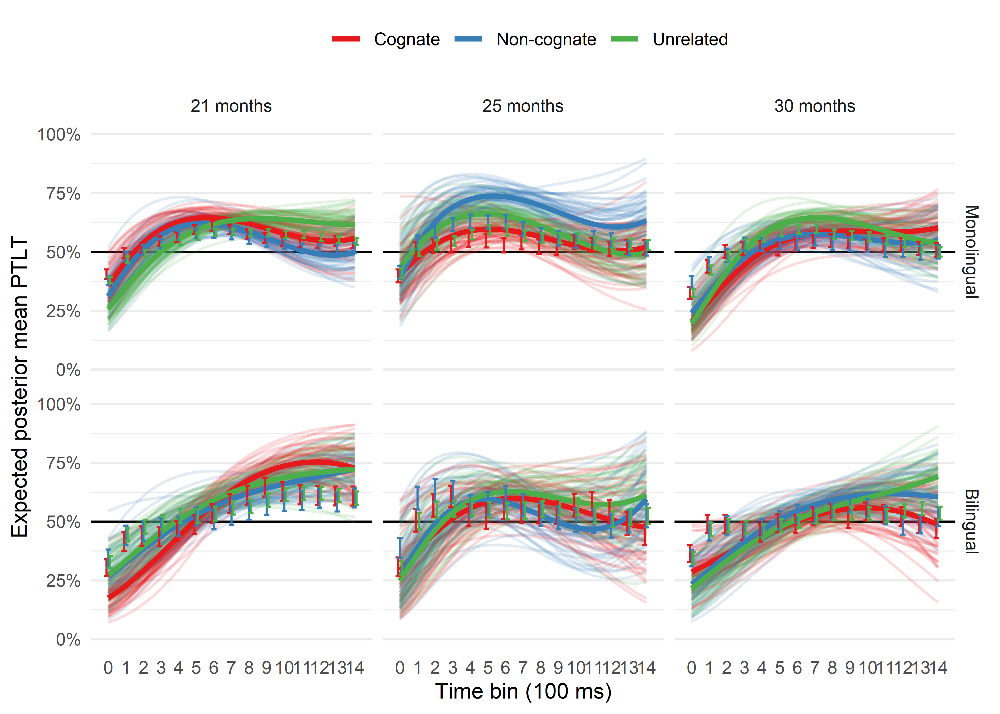

Previous studies have provided evidence that lexical access is language non-selective in bilinguals: recognising and producing words in one language activates lexical representations of words in the other language [e.g., @costa2000cognate; @thierry2007brain]. It has been suggested that this parallel activation is already present during toddlerhood [e.g., @von2012language; @jardak2019labels], but it is unclear how this parallel activation impacts the developing lexicon. We tested Catalan-Spanish and English-Spanish bilinguals in a word recognition task. Participants were tested exclusively in their language of most exposure. two pictures were presented side-by-side, one of them was named, and participants' visual preference for the named (target) picture was taken as a proxy of word recognition. Each pair of pictures was preceded by the presentation of a silent image (prime). We manipulated two variables regarding to the relationship between the label associated to the prime image and the target word: their phonological overlap in the testing language and the cognate status of the prime label. This resulted in three types of trials: trials in which prime and target labels shared phonological onset and the prime label was a cognate (cognate trials; e.g., *flower*/*flor*-*bird*, for an English-Spanish participant), trials where prime and target labels shared phonological onset but the prime label was a non-cognate (non-cognate trials; e.g., *chair*/*silla*-*bird*), and trials where prime and target labels did not share phonological onset (unrelated trials; *car*/*coche*-*bird*).

In line with previous studies, we expected participants to generate implicit labels for the prime pictures, which should interfere with target word recognition when both words share phonological onset [e.g.; @mani2010infant]. Under the hypothesis that bilingual participants would activate labels for the prime pictures in both languages, we further predicted  that interference over target word recognition would be stronger after cognate primes (labels from both languages interfere with target word recognition) than after non-cognate primes (only the label in the target language interferes with target word recognition). We tested bilinguals (and same-aged monolingual controls) at three age points (21, 25, and 30 months) to investigate how any cross-language priming effect emerged or changed across these ages, capitalising on the potential role of vocabulary size. Preliminary data suggest that bilinguals were almost insensitive to the phonological similarity between the prime and the spoken target word, or to the cognate status of the prime label. Surprisingly, monolinguals' preference for the target picture at 25 was stronger after non-cognate primes, compared to cognate primes or unrelated primes, and also after cognate and non-cognate primes compared to unrelated primes. We present this preliminary data along with exploratory analyses addressing the puzzling pattern of results we observed. 

